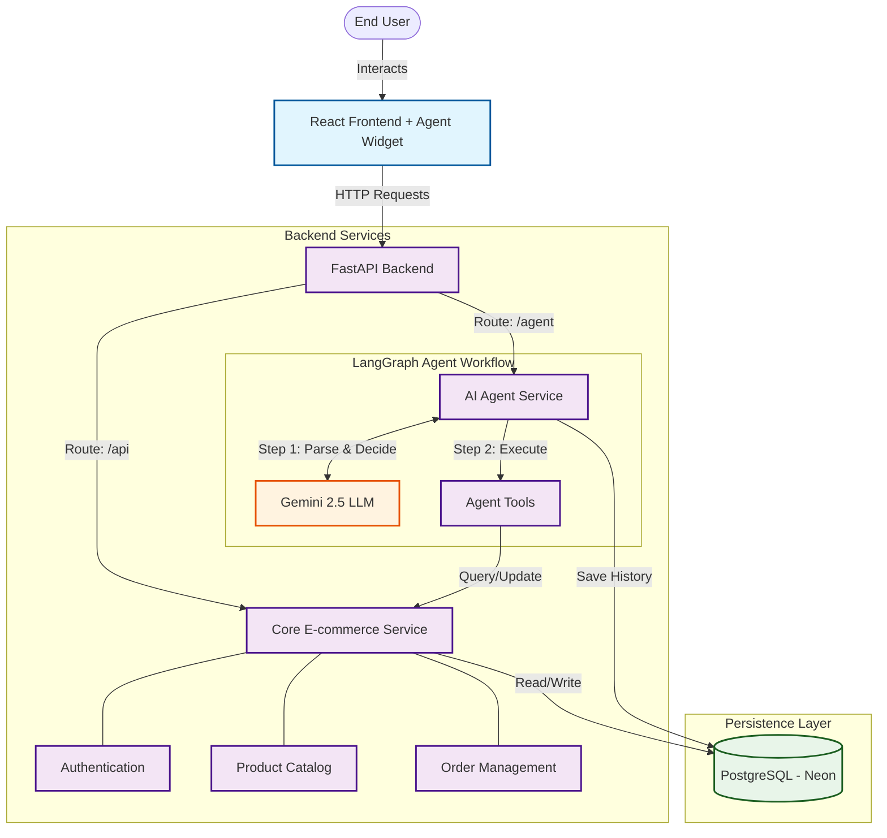

# System Architecture Diagram

This diagram provides a simplified view of how the E-commerce application and its AI Assistant Agent are structured and how they interact.

## Component Breakdowns

### 1. **React Frontend**
The user interface built with React, featuring a dedicated **Agent Widget** for natural language shopping assistance.

### 2. **FastAPI Backend**
A unified backend serving both core e-commerce REST APIs and the intelligent agent endpoints.

### 3. **AI Agent Service (LangGraph)**
Orchestrates the conversation flow using **LangGraph**. It manages state, maintains conversation history, and handles the logic for when to call external LLMs or internal tools.

### 4. **Agent Tools**
Bridge the GAP between the LLM and the application's data. Tools include:
- **Search Products**: Queries the database for relevant items.
- **Manage Cart**: Adds or removes items from the user's active session.
- **Checkout**: Finalizes the order process.

### 5. **PostgreSQL (Neon DB)**
The central source of truth, storing:
- **Core Data**: Users, Product Catalog, and Orders.
- **Agent Data**: Conversational history and session metadata for context-aware interactions.

### 6. **Gemini 2.5 LLM**
The brain behind the agent, responsible for understanding user intent and generating human-like responses.
